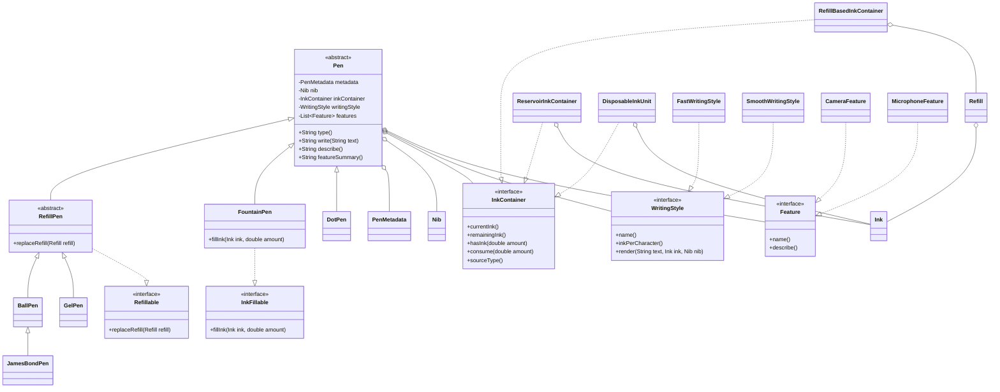

# PenCodex

This version models a pen around composition and capability interfaces instead of a deep inheritance tree.

- `Pen` owns the stable parts of the domain: metadata, nib, ink source, writing style, and optional features.
- `InkContainer` captures how ink is stored.
- `Refillable` and `InkFillable` capture what a pen can do.
- Concrete pens stay thin and only express true type differences.

