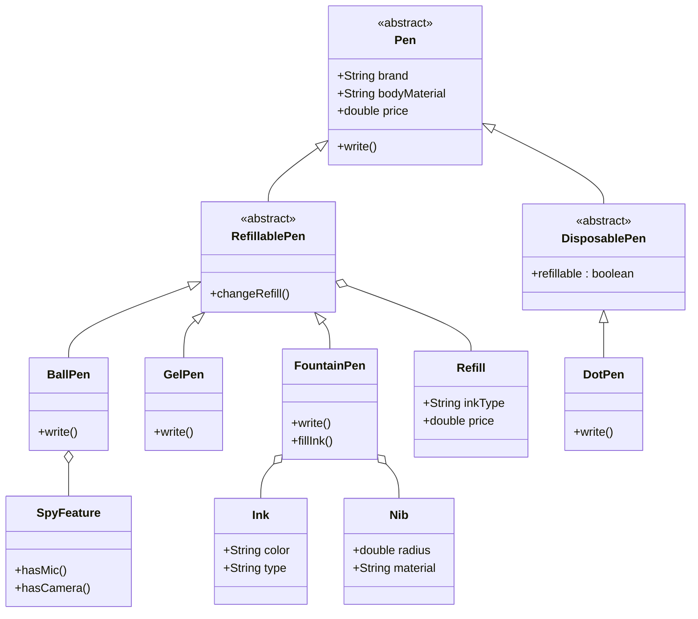

```mermaid
classDiagram
    class Pen {
        <<abstract>>
        +String brand
        +String bodyMaterial
        +double price
        +write()
    }

    class RefillablePen {
        <<abstract>>
        +changeRefill()
    }

    class DisposablePen {
        <<abstract>>
        +refillable : boolean
    }

    class BallPen {
        +write()
    }

    class GelPen {
        +write()
    }

    class FountainPen {
        +write()
        +fillInk()
    }

    class DotPen {
        +write()
    }

    class Refill {
        +String inkType
        +double price
    }

    class Ink {
        +String color
        +String type
    }

    class Nib {
        +double radius
        +String material
    }

    class SpyFeature {
        +hasMic()
        +hasCamera()
    }

    Pen <|-- RefillablePen
    Pen <|-- DisposablePen

    RefillablePen <|-- BallPen
    RefillablePen <|-- GelPen
    RefillablePen <|-- FountainPen

    DisposablePen <|-- DotPen

    RefillablePen o-- Refill
    FountainPen o-- Ink
    FountainPen o-- Nib

    BallPen o-- SpyFeature
```