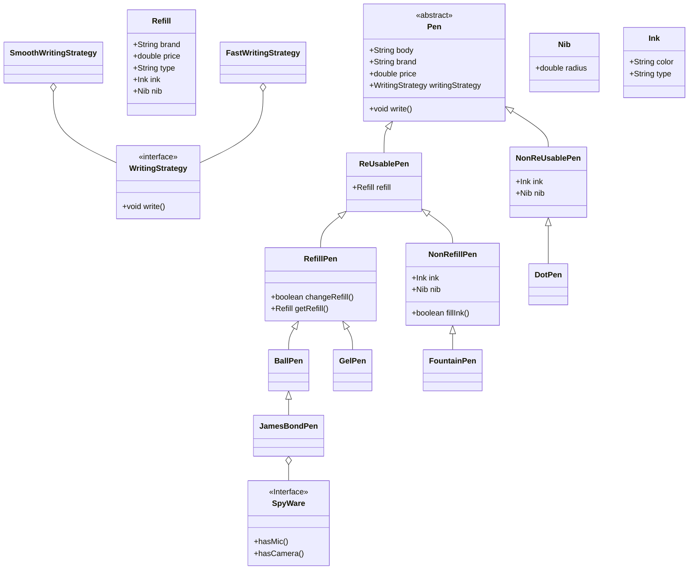

```mermaid
classDiagram
    class Pen {
        <<abstract>>
        +String body
        +String brand
        +double price
        +WritingStrategy writingStrategy 
        +void write()
    }

    class Refill {
        +String brand
        +double price
        +String type
        +Ink ink
        +Nib nib
    }
    
    class WritingStrategy{
        <<interface>>
        +void write()
    }
    
    class SmoothWritingStrategy{
        
    }
    
    class FastWritingStrategy{
        
    }
    
    class Nib {
        +double radius
    }

    class Ink {
        +String color
        +String type
    }

    class ReUsablePen {
        +Refill refill
    }

    class NonReUsablePen {
        +Ink ink
        +Nib nib
    }

    class RefillPen {
        +boolean changeRefill()
        +Refill getRefill()
    }

    class NonRefillPen {
        +Ink ink
        +Nib nib
        +boolean fillInk()
    }

    class SpyWare {
        <<Interface>>
        +hasMic()
        +hasCamera()
    }

    Pen <|-- ReUsablePen
    Pen <|-- NonReUsablePen


    ReUsablePen <|-- RefillPen
    ReUsablePen <|-- NonRefillPen
    
    
    RefillPen <|-- BallPen
    RefillPen <|-- GelPen
    NonRefillPen <|-- FountainPen
    NonReUsablePen <|-- DotPen
    BallPen <|-- JamesBondPen
    JamesBondPen o-- SpyWare
    SmoothWritingStrategy o-- WritingStrategy
    FastWritingStrategy o-- WritingStrategy
    
    
```