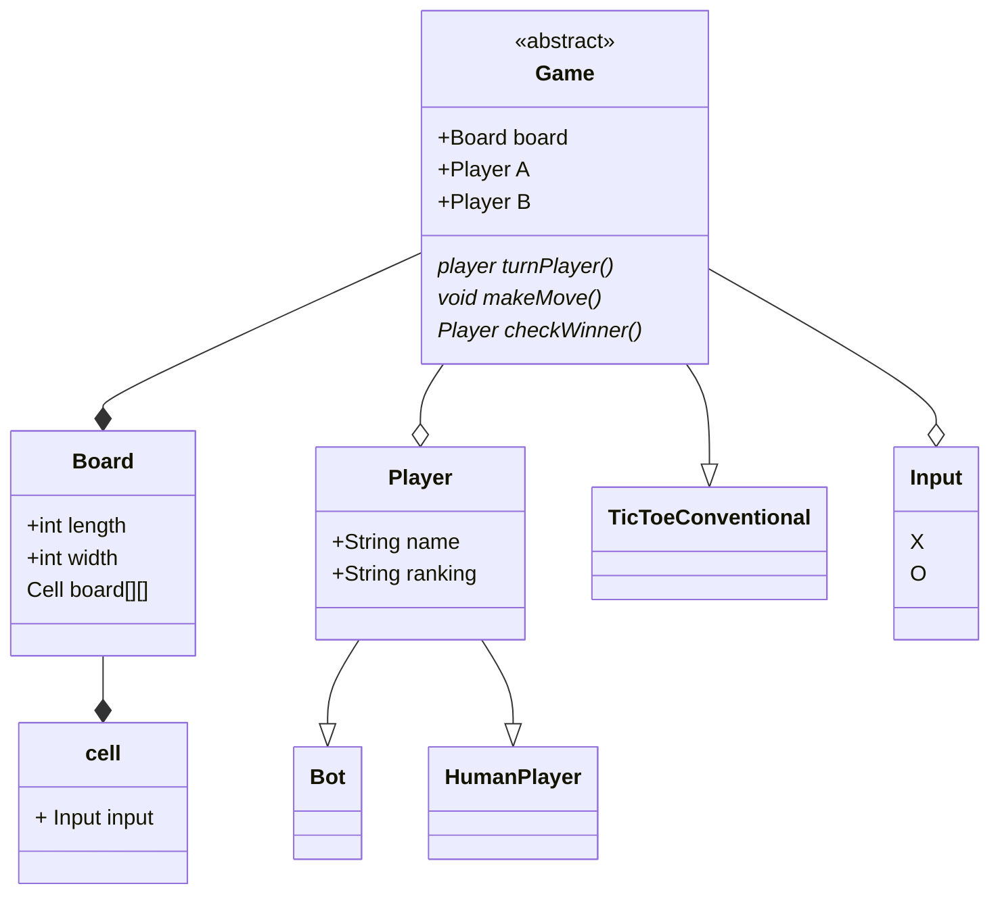

Entities
Game
Player
game inputs
game dimension

functionalities
size - n*n
how many players can play - 2 players
types of players - Humans vs Humans and Human vs Bot
attr of the players
Player - 
    Name 
    Ranking
Bot 
    Difficulty 
how will a player win the game
    n same inputs in a row, or column or diagonal
