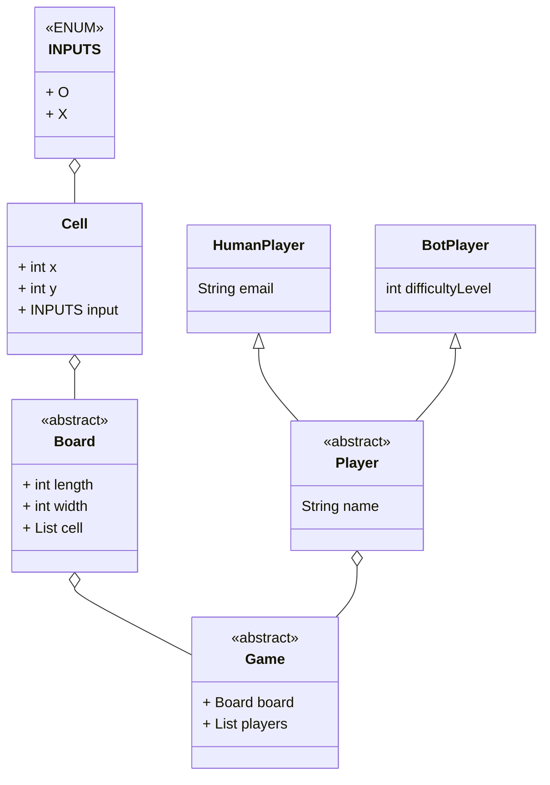

```mermaid
classDiagram 
    class Game{
        <<abstract>>
        + Board board
        + List<Player> players
    }
    class Board{
        <<abstract>>
        + int length
        + int width
        + List<Cell> cell
    }
    class Player{
        <<abstract>>
        String name
    }
    class INPUTS{
        <<ENUM>>
        + O
        + X  
    }
    class HumanPlayer{
        String email
    }
    class BotPlayer{
        int difficultyLevel
    }
    class Cell {
        + int x
        + int y
        + INPUTS input
    }
    INPUTS o-- Cell
    Cell o-- Board
    Board o-- Game
    Player o-- Game
    HumanPlayer <|-- Player
    BotPlayer <|-- Player
```